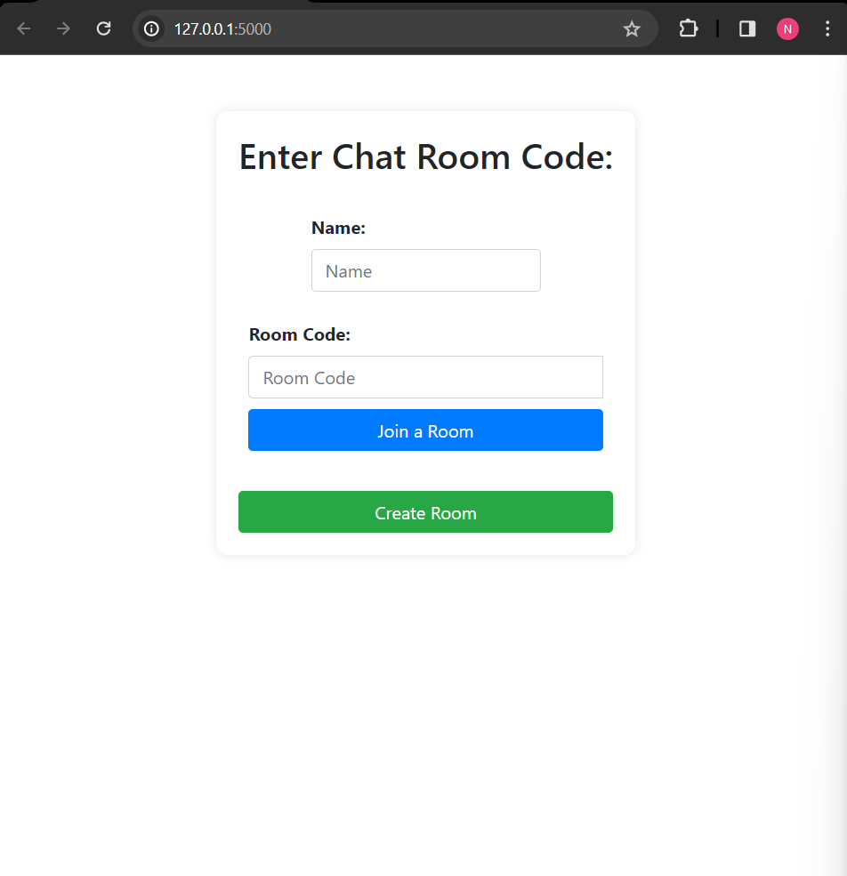
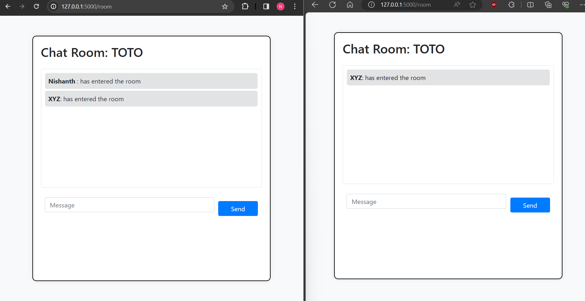
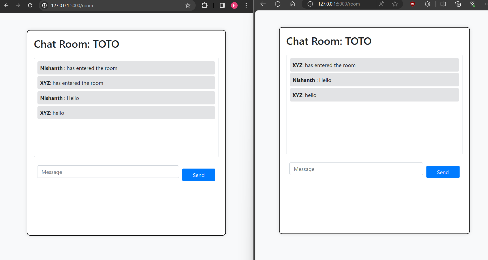

<h1>🚀 Flask-SocketIO Chat Web App</h1>

Description: Experience real-time communication like never before! Our chat web app, powered by Flask and Socket.IO, connects users seamlessly across devices. 
  Whether you’re collaborating with colleagues, catching up with friends, or organizing events, our intuitive interface ensures smooth conversations. 

Feel free to customize this description further for your GitHub README.md file. Happy coding!

<h2>Screenshots of the website</h2>

<h4>Home Page</h4>

<h4>Main Chat Page</h4>

<h4>Communication in Action</h4>

<h4>Demo Video</h4>

